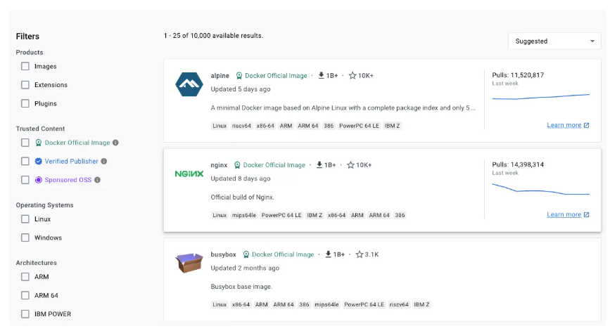

# Qu’est-ce que Docker ?

Docker est une **plateforme ouverte** destinée au développement, à la livraison et à l’exécution d’applications.

L’idée clé de Docker est de vous permettre de **séparer vos applications de votre infrastructure**. Grâce à cela, vous pouvez livrer vos logiciels plus rapidement, de manière plus fiable et plus flexible.

Avec Docker, vous pouvez gérer votre infrastructure **comme vous gérez vos applications** : de façon agile, automatisée et reproductible. En exploitant les méthodologies de Docker pour la livraison, les tests et le déploiement de code, vous réduisez considérablement le délai entre le moment où un développeur écrit du code et le moment où ce code tourne réellement en production.

***

### La plateforme Docker

Docker vous permet d’**emballer et d’exécuter une application** dans un environnement isolé appelé **conteneur**.

* Cet **isolement** et cette **sécurité** vous permettent d’exécuter plusieurs conteneurs en parallèle sur une même machine (appelée **hôte**).
* Les conteneurs sont **légers** et embarquent **tout ce dont l’application a besoin pour fonctionner** (dépendances, bibliothèques, configuration…).
* Résultat : vous n’avez pas à vous soucier de ce qui est installé sur la machine hôte.
* Vous pouvez **partager vos conteneurs** avec vos collègues ou collaborateurs, et être certain que tout le monde dispose du **même environnement de fonctionnement**.

En résumé, Docker fournit à la fois des **outils** et une **plateforme complète** pour gérer le cycle de vie de vos conteneurs :

1. **Développer** votre application et ses composants avec des conteneurs.
2. Le conteneur devient alors **l’unité de distribution et de test** de votre application.
3. Quand vous êtes prêt, vous pouvez **déployer** votre application en production, soit directement sous forme de conteneur, soit comme un service orchestré.
   * Cela fonctionne de la même manière que votre environnement de production soit un **datacenter local**, un **cloud public/privé**, ou une **infrastructure hybride**.

***

### À quoi sert Docker ?

#### 1. Une livraison rapide et cohérente de vos applications

Docker simplifie le **cycle de vie de développement** en permettant aux développeurs de travailler dans des environnements standardisés, grâce aux conteneurs locaux qui embarquent vos applications et services.

Les conteneurs s’intègrent parfaitement dans les processus de **CI/CD** (Intégration Continue et Livraison Continue).

***

#### Exemple concret :

* Les développeurs écrivent du code sur leur machine et le partagent avec leurs collègues via des conteneurs Docker.
* Ils utilisent Docker pour **pousser leurs applications dans un environnement de test**, où elles subissent des tests automatiques et manuels.
* Si des bugs sont détectés, ils sont corrigés **dans l’environnement de développement**, puis le conteneur est à nouveau déployé dans l’environnement de test pour validation.
* Une fois les tests validés, **mettre la correction à disposition du client** devient aussi simple que de pousser l’**image mise à jour** dans l’environnement de production.

***

👉 Docker apporte donc :

* **Cohérence** : le même conteneur fonctionne partout de la même façon.
* **Rapidité** : le cycle “développement → test → production” est fluide.
* **Fiabilité** : moins de surprises liées aux différences d’environnements.

## Déploiement flexible et montée en charge

La plateforme de conteneurs de Docker permet d’avoir des **charges de travail hautement portables**.

* Les conteneurs Docker peuvent tourner aussi bien :
  * sur l’ordinateur portable d’un développeur,
  * sur des machines physiques ou virtuelles dans un **datacenter**,
  * chez des fournisseurs de **cloud**,
  * ou même dans une combinaison de tous ces environnements (**hybride**).

👉 En clair, peu importe où vous exécutez vos applications, **le conteneur reste identique et fonctionne de la même manière**.

La **portabilité** et la **légèreté** de Docker rendent aussi possible une gestion dynamique des charges de travail :

* vous pouvez augmenter rapidement la capacité (**scaling up**) quand la demande monte,
* ou réduire/détruire certains conteneurs (**scaling down**) quand vous n’en avez plus besoin.

Et tout cela peut se faire **quasi en temps réel**, en fonction des besoins de l’entreprise.

***

## Exécuter plus de charges de travail avec le même matériel

Docker est **léger** et **rapide**.

* Il représente une alternative économique et performante aux **machines virtuelles basées sur hyperviseur**.
* Résultat : vous exploitez mieux la capacité de vos serveurs pour atteindre vos objectifs métier.

Docker est donc particulièrement adapté pour :

* des environnements à **forte densité** (exécuter beaucoup de conteneurs sur peu de machines),
* mais aussi pour des **déploiements de petite ou moyenne taille**, où l’on cherche à **faire plus avec moins de ressources**.

***

## Architecture de Docker

Docker repose sur une **architecture client-serveur** :

* **Docker client** (le client Docker) :
  * C’est l’outil que vous utilisez pour interagir avec Docker.
  * Exemple : la commande `docker run`, `docker build`, etc.
  * Il envoie vos instructions au serveur.
* **Docker daemon** (le démon Docker) :
  * C’est le moteur qui fait **tout le travail lourd** :
    * construire les images,
    * exécuter les conteneurs,
    * distribuer les conteneurs.
  * Le client et le démon peuvent tourner sur la **même machine**,
  * mais vous pouvez aussi connecter un client à un démon distant.
* **Communication entre client et démon** :
  * via une **API REST**,
  * utilisant des **sockets UNIX** (localement) ou une **interface réseau** (distante).
* **Docker Compose** :
  * C’est un autre client Docker.
  * Il vous permet de gérer des applications **composées de plusieurs conteneurs** (exemple : une API + une base de données + un service cache).

***

👉 Cette architecture rend Docker **modulaire** et **flexible** : vous pouvez interagir localement ou à distance, lancer un seul conteneur ou orchestrer des dizaines, sans changer vos outils de base.

<figure><figcaption></figcaption></figure>

## Le démon Docker (**Docker daemon**)

Le démon Docker (**dockerd**) est le **cœur moteur** de Docker.

* Il écoute les **requêtes de l’API Docker**.
* Il gère tous les **objets Docker** :
  * **images**,
  * **conteneurs**,
  * **réseaux**,
  * **volumes**.
* Un démon peut aussi **communiquer avec d’autres démons** pour gérer des services Docker répartis.

👉 En résumé : **dockerd est celui qui exécute concrètement vos instructions** (lorsque le client lui envoie des commandes).

***

## Le client Docker (**Docker client**)

Le client Docker (**docker**) est **l’interface principale** que les utilisateurs emploient pour interagir avec Docker.

* Exemple : quand vous tapez `docker run`, `docker build` ou `docker ps`.
* Le client envoie la commande au démon (**dockerd**) via l’API Docker.
* C’est le démon qui exécute l’action demandée.

👉 Le client peut communiquer avec **plusieurs démons** (utile si vous gérez différents environnements).

En résumé : **vous parlez au client → le client parle au démon → le démon agit**.

***

## Docker Desktop

**Docker Desktop** est une application simple à installer pour **Mac, Windows et Linux**.

Il permet de :

* construire et partager des applications conteneurisées et des microservices,
* disposer de tous les outils Docker réunis dans un seul paquet.

Docker Desktop inclut :

* le démon Docker (**dockerd**),
* le client Docker (**docker**),
* **Docker Compose** (gestion d’applications multi-conteneurs),
* **Docker Content Trust** (sécurité des images),
* **Kubernetes** (orchestration de conteneurs),
* **Credential Helper** (gestion des identifiants de connexion).

👉 C’est l’option la plus simple pour **démarrer rapidement avec Docker** sur son poste de travail.

***

## Les registres Docker (**Docker registries**)

Un **registre Docker** est un espace de stockage pour les **images Docker**.

* **Docker Hub** est le registre public par défaut.
  * Tout le monde peut y publier ou télécharger des images.
  * Quand vous lancez une commande sans préciser de registre, Docker cherche automatiquement sur **Docker Hub**.
* Vous pouvez aussi mettre en place votre **registre privé** (pour votre entreprise ou vos projets internes).

Commandes associées :

* `docker pull` ou `docker run` → Docker **télécharge l’image** depuis le registre configuré.
* `docker push` → Docker **envoie votre image** vers le registre configuré.

👉 Les registres rendent possible le partage, la distribution et la réutilisation des images de manière centralisée et standardisée.

***

📌 Pour résumer cette section :

* **dockerd (daemon)** → le moteur.
* **docker (client)** → l’interface pour envoyer des commandes.
* **Docker Desktop** → le package tout-en-un pour développer facilement.
* **Docker Registry** → la bibliothèque où vos images sont stockées, publiques ou privées.

## ⚙️ Les objets Docker

Quand vous utilisez Docker, vous manipulez différents **objets** :\
👉 **images**, **conteneurs**, **réseaux**, **volumes**, **plugins**, et bien d’autres.

Voici un aperçu simplifié des plus importants 👇

***

### 🖼️ Les images :&#x20;

Une **image** est un **modèle en lecture seule** contenant les instructions nécessaires pour créer un conteneur.

* Souvent, une image est basée sur une **autre image** avec des personnalisations.
  * Exemple : une image basée sur **Ubuntu**, dans laquelle on installe **Apache** et votre application, ainsi que la configuration nécessaire pour la faire tourner.
* Vous pouvez :
  * créer vos propres images 🛠️,
  * ou réutiliser celles publiées par d’autres dans un **registre** (comme Docker Hub).

👉 Pour construire une image, vous écrivez un **Dockerfile** :

* Un fichier texte avec une syntaxe simple qui décrit **étape par étape** la création de l’image.
* Chaque instruction dans le Dockerfile crée une **couche** (_layer_).
* Quand vous modifiez le Dockerfile et reconstruisez l’image, seules les couches modifiées sont reconstruites.

✅ Résultat : les images Docker sont **légères, rapides et efficaces**, bien plus que les technologies de virtualisation classiques.

***

### 📦 Les conteneurs

Un **conteneur** est une **instance exécutable d’une image**.

Vous pouvez, via l’API ou la CLI (`docker` en ligne de commande) :

* créer ➕,
* démarrer ▶️,
* arrêter ⏹️,
* déplacer ↔️,
* ou supprimer ❌ un conteneur.

Vous pouvez aussi :

* connecter un conteneur à un ou plusieurs **réseaux** 🌐,
* lui attacher du **stockage** 💾,
* ou même créer une **nouvelle image** basée sur son état actuel.

👉 Par défaut, un conteneur est **isolé** :

* de son hôte,
* et des autres conteneurs.

Vous contrôlez le niveau d’isolation (réseau, stockage, etc.).

Un conteneur est donc défini par :

* **l’image** sur laquelle il repose,
*
  * les **options de configuration** que vous lui fournissez au démarrage.

⚠️ Quand un conteneur est supprimé, toutes les données **non stockées dans un volume persistant** disparaissent.

***

### 💻 Exemple : commande `docker run`

```bash
docker run -i -t ubuntu /bin/bash
```

Ce que fait cette commande pas à pas 👇 (si vous utilisez la config par défaut) :

1. 📥 Si l’image **ubuntu** n’est pas disponible localement, Docker la **télécharge depuis le registre** (comme avec `docker pull ubuntu`).
2. 📦 Docker **crée un nouveau conteneur** (équivalent à `docker container create`).
3. 📂 Docker ajoute un **système de fichiers en lecture/écriture** comme couche finale → le conteneur peut modifier/créer des fichiers.
4. 🌐 Docker crée une **interface réseau** et attribue une **adresse IP** au conteneur. Par défaut, il peut se connecter à Internet via le réseau de l’hôte.
5. ▶️ Docker démarre le conteneur et exécute `/bin/bash`.
   * Grâce aux options `-i -t`, vous êtes **connecté de manière interactive** :
     * vous tapez des commandes au clavier,
     * vous voyez la sortie dans votre terminal.
6. ⏹️ Quand vous tapez `exit`, le conteneur **s’arrête** mais n’est **pas supprimé**. Vous pouvez donc le redémarrer ou l’effacer.

***

### 🛠️ La technologie sous-jacente

Docker est écrit en **Go** et s’appuie sur des fonctionnalités du **noyau Linux**.

👉 La clé : les **namespaces**.

* Quand vous lancez un conteneur, Docker crée un ensemble de **namespaces** pour lui.
* Chaque namespace est une “bulle isolée” :
  * espace processus,
  * espace réseau,
  * espace système de fichiers, etc.
* Cette isolation garantit que le conteneur ne voit que **son propre environnement**.

✅ C’est ce mécanisme qui rend les conteneurs **légers mais parfaitement isolés**.

***

👉 En résumé :

* **Image** = modèle 📄.
* **Conteneur** = instance exécutable 🚀.
* **Dockerfile** = recette de construction 🍳.
* **Namespaces** = isolement garanti 🔒.
